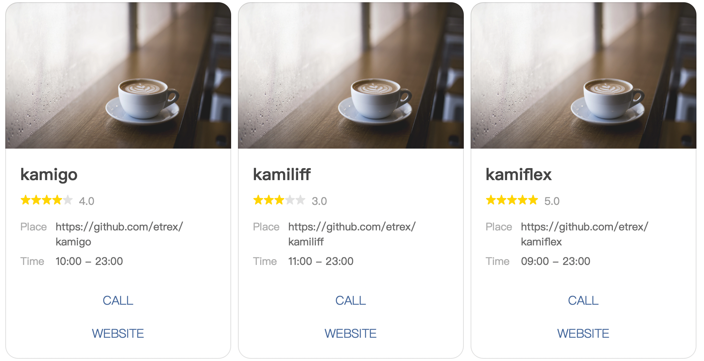

# Kamiflex
Kamiflex provide a pretty DSL to build your [flex message of line messaging api](https://developers.line.biz/en/docs/messaging-api/using-flex-messages/) like this:


# Live Demo

[Kamiflex Simulator](https://kamiflex.etrex.tw/)

#### in pure ruby

# [example/cards.rb](example/cards.rb)

``` ruby
require 'kamiflex'

@products = [
  {
    name: "kamigo",
    star: 4,
    place: "https://github.com/etrex/kamigo",
    time: "10:00 - 23:00",
    contact_url: "https://github.com/etrex/kamigo",
    product_url: "https://github.com/etrex/kamigo"
  },
  {
    name: "kamiliff",
    star: 3,
    place: "https://github.com/etrex/kamiliff",
    time: "11:00 - 23:00",
    contact_url: "https://github.com/etrex/kamiliff",
    product_url: "https://github.com/etrex/kamiliff"
  },
  {
    name: "kamiflex",
    star: 5,
    place: "https://github.com/etrex/kamiflex",
    time: "09:00 - 23:00",
    contact_url: "https://github.com/etrex/kamiflex",
    product_url: "https://github.com/etrex/kamiflex"
  },
]

def star(num)
  baseline_box margin: :md do
    (0...num).each do
      icon "https://scdn.line-apps.com/n/channel_devcenter/img/fx/review_gold_star_28.png", size: :sm
    end
    (num...5).each do
      icon "https://scdn.line-apps.com/n/channel_devcenter/img/fx/review_gray_star_28.png", size: :sm
    end
    text "#{num}.0", size: :sm, color: "#999999", margin: :md, flex: 0
  end
end

def field(key, value)
  baseline_box spacing: :sm do
    text key, "color":"#aaaaaa","size":"sm","flex":1
    text value, "wrap":true,"color":"#666666","size":"sm","flex":5
  end
end

json = Kamiflex.build(self) do
  carousel do
    bubbles @products do |product|
      hero "https://scdn.line-apps.com/n/channel_devcenter/img/fx/01_1_cafe.png",
        size: :full, aspectRatio: "20:13", aspectMode: :cover, action: uri_action("http://linecorp.com/")
      body do
        text product[:name], weight: :bold, size: :xl
        star(product[:star])
        vertical_box margin: :lg, spacing: :sm do
          field "Place", product[:place]
          field "Time", product[:time]
        end
      end
      footer spacing: :sm, flex: 0 do
        url_button "CALL", product[:contact_url], style: :link, height: :sm
        url_button "WEBSITE", product[:product_url], style: :link, height: :sm
        spacer size: :sm
      end
    end
  end
end

puts json
```



#### in rails
``` ruby
# todos/index.line.erb
<%= raw Kamiflex.build(self) do
  bubble do
    body do
      horizontal_box do
        text "🍔", flex: 0, action: message_action("/")
        text "Todos"
        text "🆕", align: "end", action: uri_action(new_todo_path)
      end
      separator
      if @todos.present?
        vertical_box margin: "lg" do
          horizontal_box @todos, margin: "lg" do |todo|
            text todo.name, action: message_action("/todos/#{todo.id}")
            text "❌", align: "end", action: message_action("DELETE /todos/#{todo.id}")
          end
        end
      else
        text "no contents yet", margin: "lg"
      end
    end
  end
end %>
```

I will make a template name `flex` for rails in the future.

With this template, it's more clear then `erb`.

``` ruby
# todos/index.line.flex
bubble do
  body do
    horizontal_box do
      text "🍔", flex: 0, action: message_action("/")
      text "Todos"
      text "🆕", align: "end", action: uri_action(new_todo_path)
    end
    separator
    if @todos.present?
      vertical_box margin: "lg" do
        horizontal_box @todos, margin: "lg" do |todo|
          text todo.name, action: message_action("/todos/#{todo.id}")
          text "❌", align: "end", action: message_action("DELETE /todos/#{todo.id}")
        end
      end
    else
      text "no contents yet", margin: "lg"
    end
  end
end
```

## Installation
Add this line to your application's Gemfile:

```ruby
gem 'kamiflex'
```

## Author
Create by [etrex](https://etrex.tw)

## License
The gem is available as open source under the terms of the [MIT License](https://opensource.org/licenses/MIT).
