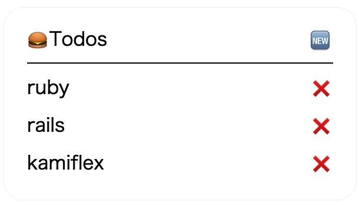

# Kamiflex
provide a pretty DSL to build your flex message like this:

#### in ruby
``` ruby
# example/todos_index.rb
require 'kamiflex'

@todos = [
  {
    id: 1,
    name: "ruby"
  },
  {
    id: 2,
    name: "rails"
  },
  {
    id: 3,
    name: "kamiflex"
  }
]

json = Kamiflex.build(self) do
  bubble do
    body do
      horizontal_box do
        text "🍔", flex: 0, action: message_action("/")
        text "Todos"
        text "🆕", align: "end", action: uri_action(new_todo_path))
      end
      separator
      if @todos.present?
        vertical_box margin: "lg" do
          horizontal_box @todos, margin: "lg" do |todo|
            text todo[:name], action: message_action("/todos/#{todo[:id]}")
            text "❌", align: "end", action: message_action("DELETE /todos/#{todo[:id]}")
          end
        end
      else
        text "no contents yet", margin: "lg"
      end
    end
  end
end

puts json
```

the render result looks like this:



#### in rails
``` ruby
# todos/index.line.erb
<%= raw(Kamiflex.build(self) do
  bubble do
    body do
      horizontal_box do
        text "🍔", flex: 0, action: message_action("/")
        text "Todos"
        text "🆕", align: "end", action: uri_action(new_todo_path))
      end
      separator
      if @todos.present?
        vertical_box margin: "lg" do
          horizontal_box @todos, margin: "lg" do |todo|
            text todo.name, action: message_action("/todos/#{todo.id}")
            text "❌", align: "end", action: message_action("DELETE /todos/#{todo.id}")
          end
        end
      else
        text "no contents yet", margin: "lg"
      end
    end
  end
end )%>
```

I will make a template name `flex` for rails in the future.

With this template, it's more clear then `erb`.
``` ruby
# todos/index.line.flex
bubble do
  body do
    horizontal_box do
      text "🍔", flex: 0, action: message_action("/")
      text "Todos"
      text "🆕", align: "end", action: uri_action(new_todo_path))
    end
    separator
    if @todos.present?
      vertical_box margin: "lg" do
        horizontal_box @todos, margin: "lg" do |todo|
          text todo.name, action: message_action("/todos/#{todo.id}")
          text "❌", align: "end", action: message_action("DELETE /todos/#{todo.id}")
        end
      end
    else
      text "no contents yet", margin: "lg"
    end
  end
end
```

## Installation
Add this line to your application's Gemfile:

```ruby
gem 'kamiflex'
```

## License
The gem is available as open source under the terms of the [MIT License](https://opensource.org/licenses/MIT).
